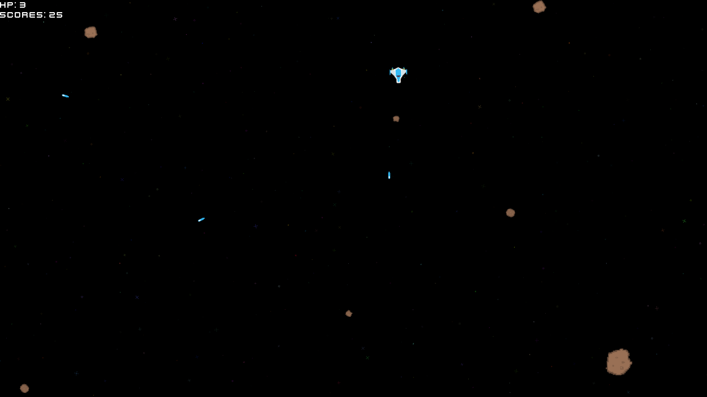

# Proto Asteroids

Classical implementation or the [Asteroids Game](https://en.wikipedia.org/wiki/Asteroids_(video_game)) with some adjustments. You control small space ship and you taks is simple - **survive**! The goal of the repo is to create same game in different engies, frameworks and paradigms.

# Development Status
| Engine/Framework  | Status        |
| -------------     | ------------- |
| MonoGame/C#       | :green_heart: |
| MonoGame EC/C#    | :boom:        |
| MonoGame ECS/C#   | :boom:        |
| MonoGame ELM/F#   | :boom:        |
| GMS               | :green_heart: |
| Godot/C#          | :green_heart: |
| Godot/GDScript    | :snowflake:   |
| Ceramic/Haxe      | :boom:        |
| Defold/Lua        | :snowflake:   |
| Unity/C#          | :snowflake:   |

*Agenda*
* :green_heart: - Done
* :recycle: - Under development
* :boom: - Excited to work
* :snowflake: - Have no dezire and have no fire!

# License
* Source Code
    * Well some mine and some from Xna samples 
    * [MIT License](LICENSE)
* Graphics
  * [Space Shooter Redux](https://kenney.nl/assets/space-shooter-redux) 
    * Thank you Kenney for the great assets that inspired me to create this game!
* Fonts
  * [Kenney Fonts](https://kenney.nl/assets/kenney-fonts)
    * Thank you Kenney for the great assets!
    * [Repo Asset](content/fonts/kenney-future.font.ttf)
    * [CC0 1.0 License](https://creativecommons.org/publicdomain/zero/1.0/)
* Sfx
  * [Space Shooter Redux](https://kenney.nl/assets/space-shooter-redux)
    * Thank you Kenney for the great assets!
    * [Repo Asset](content/sounds/laser.sound.ogg)
    * [CC0 1.0 License](https://creativecommons.org/publicdomain/zero/1.0/)
  * Thank you [jsfxr](https://sfxr.me/) for soundtracks 
* Music
    * [Dreamy Space Soundtrack](https://chiphead64.itch.io/dreamy-space-soundtrack)
      * Thank you chiphead64 for the great assets!
      * [Repo Asset](content/music/menu.song.mp3)
      * [CC BY 4.0 License](https://creativecommons.org/licenses/by/4.0/)
    * [FREE Music Pack 4: Electronic 2](https://joshua-mclean.itch.io/free-music-pack-4)
      * Thank you Joshua McLean for the great assets!
      * [Repo Asset](content/music/game1.song.mp3)
      * [CC BY 4.0 License](https://creativecommons.org/licenses/by/4.0/)
    * [Izakaya Funes' Metal Pack](https://polarnyne.itch.io/izakaya-funes-metal-pack)
      * Thank you Izakaya Funes' for the great assets!
      * [Repo Asset#1](content/music/game2.song.wav)
      * [Repo Asset#2](content/music/game3.song.wav)
      * [Repo Asset#3](content/music/game4.song.wav)
      * [Repo Asset#4](content/music/game5.song.wav)
      * [Repo Asset#5](content/music/game6.song.wav)
      * [License](https://polarnyne.itch.io/izakaya-funes-metal-pack)
    * [Hair and Kuckles Techno+Metal Music Pack](https://davidkbd.itch.io/hair-and-kuckles-technometal-music-pack)
        * Thank you David KBD for the great assets!
        * [Repo Asset#1](content/music/game7.song.ogg)
        * [Repo Asset#2](content/music/game8.song.ogg)
        * [Repo Asset#3](content/music/game9.song.ogg)
        * [License](https://davidkbd.itch.io/hair-and-kuckles-technometal-music-pack)

# Stats for Develop branch
